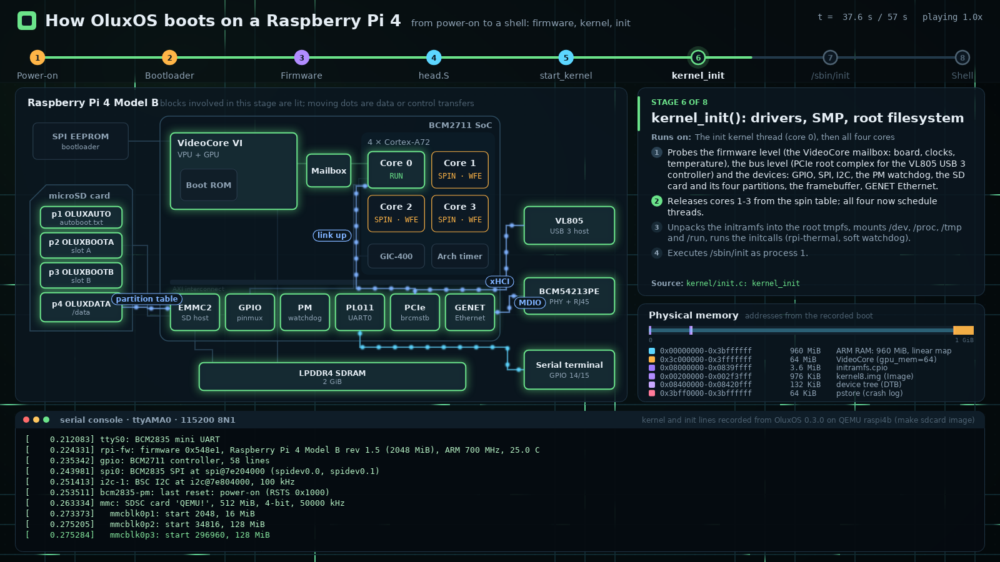
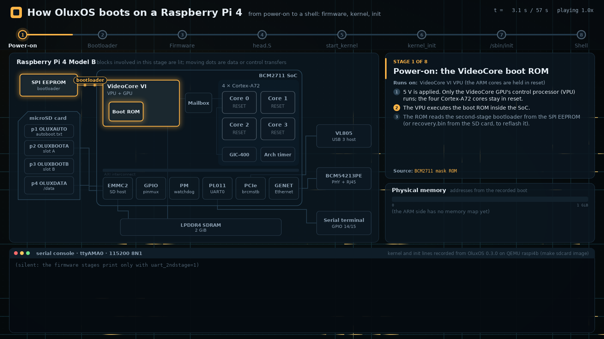
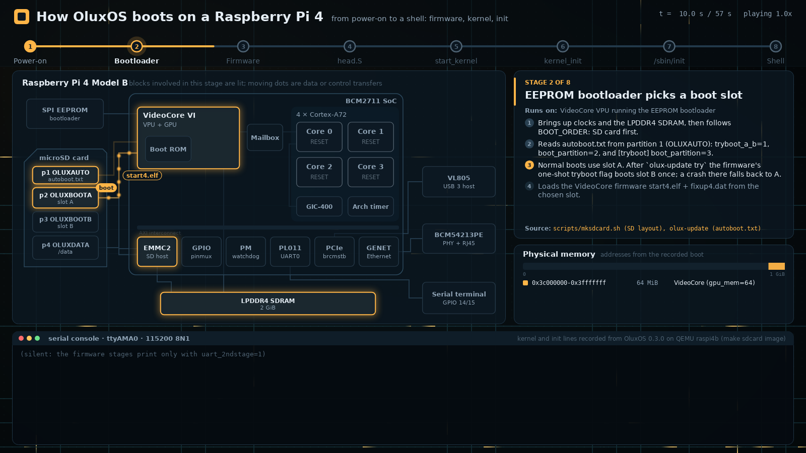
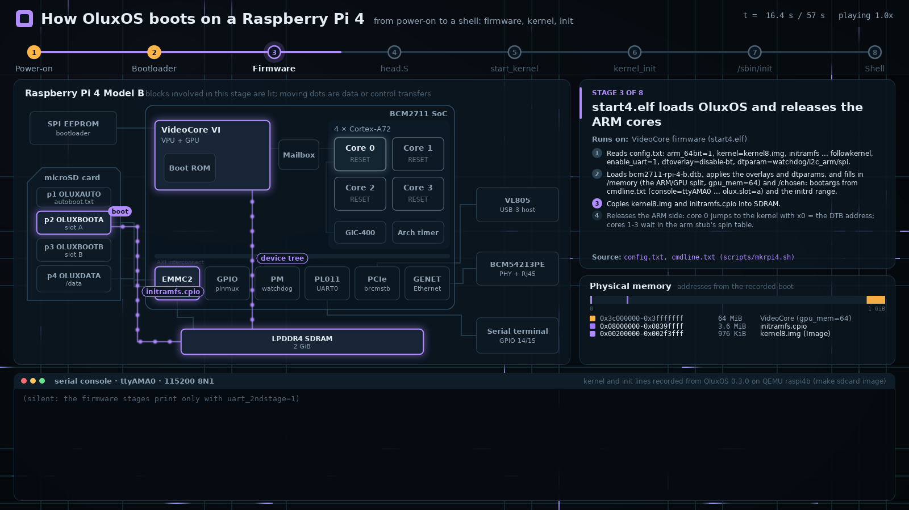
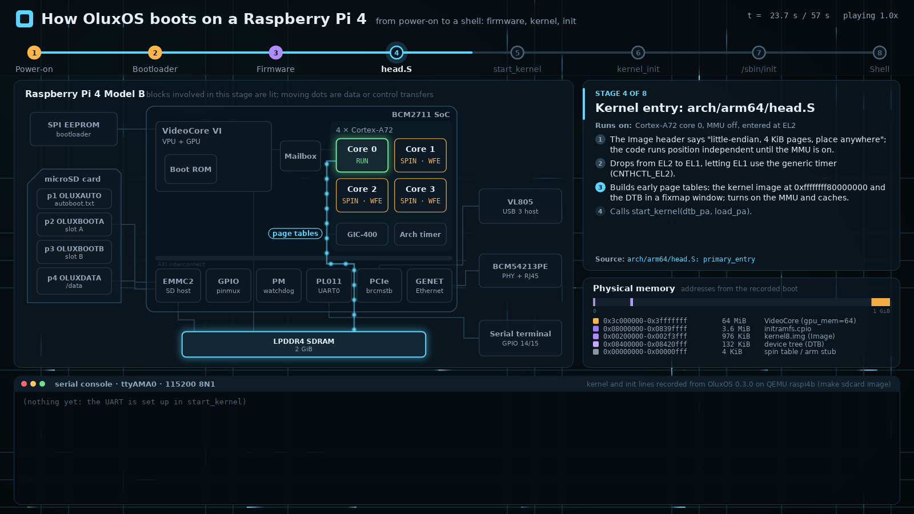
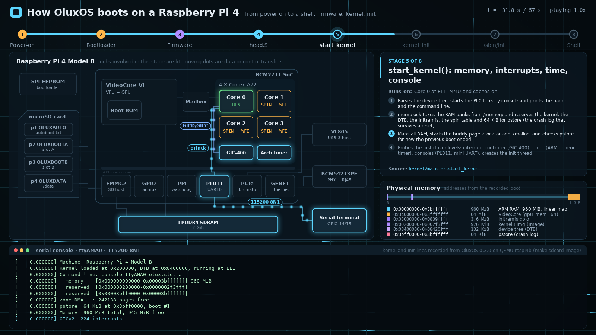
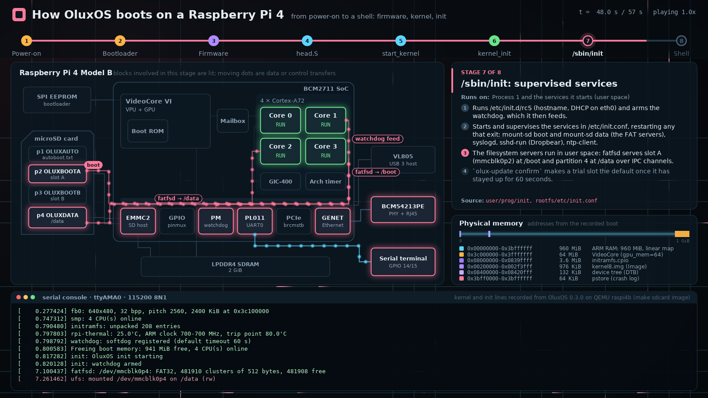
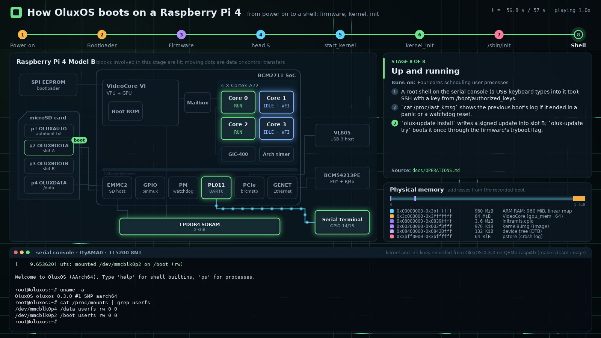
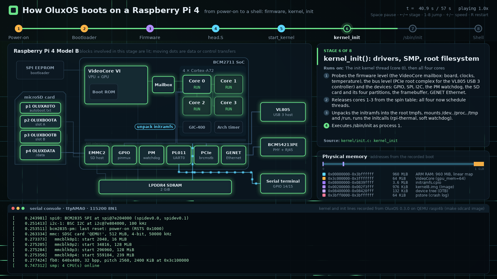

# bootviz: how OluxOS boots on a Raspberry Pi 4

An animated 2D explanation of the OluxOS boot, from power-on to a shell prompt.
**Skia** draws the scene on the CPU. **Vulkan** renders an animated
circuit-board backdrop, composites the Skia layer over it, and then either
presents the result in a window or reads it back for screenshots. The
program is written in C++20 and built with Bazel (bzlmod). The build layout,
the Skia overlay and the Vulkan plumbing follow
[twn_election](https://github.com/merckhung/twn_election).



| | |
|---|---|
| <br>1. Power-on | <br>2. Bootloader |
| <br>3. Firmware | <br>4. head.S |
| <br>5. start_kernel | <br>6. kernel_init |
| <br>7. /sbin/init | <br>8. Shell |

The interactive window (captured on a virtual X display; key hints at the top right):



## What it shows

The boot has eight stages. Each one lights up the parts of the board it
uses, animates what moves between them (images, the device tree, mailbox
messages, the console output), and fills in physical memory as regions are
loaded or reserved.

| # | Stage | Runs on | Where in OluxOS |
|---|-------|---------|-----------------|
| 1 | Power-on: the VideoCore boot ROM loads the EEPROM bootloader | VPU; the ARM cores are held in reset | — |
| 2 | The EEPROM bootloader reads `autoboot.txt` and picks boot slot A (or B once, after `olux-update try`) | VPU | `scripts/mksdcard.sh`, `olux-update` |
| 3 | `start4.elf` reads `config.txt`, builds the device tree, loads the kernel and initramfs, and releases core 0 | VPU firmware | `scripts/mkrpi4.sh` |
| 4 | Kernel entry: EL2 to EL1, early page tables, MMU on | Core 0 | `arch/arm64/head.S` |
| 5 | `start_kernel`: memory map, pstore, allocators, GIC, timer, console | Core 0 | `kernel/main.c` |
| 6 | `kernel_init`: mailbox, PCIe, devices, SD card, SMP, initramfs, then init | Init thread, then all cores | `kernel/init.c` |
| 7 | `/sbin/init`: watchdog, filesystem servers for `/boot` and `/data`, SSH, NTP | User space | `user/prog/init`, `rootfs/etc/init.conf` |
| 8 | Up and running: shell, SSH, crash log, A/B updates | User space | `docs/OPERATIONS.md` |

Every stage also has a numbered list of steps (the current step is
highlighted as the stage plays) and a pointer to the source.

The serial-console panel replays kernel and init messages recorded from
OluxOS 0.3.0 booting the `make sdcard` image on QEMU's `raspi4b` machine.
Three edits were made to the recording:

- A test-only command-line option (`rpi_thermal.trip`) was removed, along
  with its effect on the output.
- Lines about QEMU-virt-only disks were left out.
- The closing shell session is illustrative.

The memory addresses are the ones from that recorded boot. Real Pi
firmware may place the kernel and initramfs elsewhere. The firmware stages
print nothing to the UART unless `uart_2ndstage=1` is set, and the program
says so rather than inventing output.

## Build and run

Prerequisites (Ubuntu/Debian):

```sh
sudo apt install build-essential libvulkan1 mesa-vulkan-drivers libglfw3-dev \
                 glslang-tools fonts-dejavu-core git
# Bazel: bazelisk; .bazelversion pins Bazel 8.3.1
```

```sh
cd tools/bootviz
bazel run //:bootviz                                  # window, 1600x900
bazel run //:bootviz -- --speed=2 --stage=4           # start at head.S, twice as fast
bazel run //:bootviz -- --screenshot=$PWD/k.png --stage=6 --progress=0.4
tools/screenshots.sh                                  # regenerate docs/screenshots
bazel test //tests/...
```

The first build fetches Skia at a pinned commit and compiles about 600 of
its sources, which takes a few minutes.

| Key | Action |
|-----|--------|
| Space | Pause or resume |
| ← / → | Previous or next stage |
| 1–8 | Jump to a stage |
| + / − | Double or halve the speed |
| R, Home | Restart |
| Esc, Q | Quit |

`--headless` (implied by `--screenshot` and `--screenshots`) renders offscreen
with no display. Mesa's lavapipe software Vulkan driver is enough, which is
how the screenshots here were made. `--help` lists every flag.

### Restricted networks

Some networks allow `git clone` from GitHub but block archive downloads,
such as `github.com/.../archive/...` or the savannah mirrors. Four
Bazel Central Registry modules fetch their sources that way. On such a
network, run

```sh
tools/git_modules.py
```

once. It clones vulkan_headers, stb, freetype and libpng at the tag or commit
their BCR entries were made from, and applies the registry's patches and
overlay files, checking their SHA-256. It then writes `--override_module`
lines to `user.bazelrc`, which is untracked and imported by `.bazelrc`.

## Layout

```
MODULE.bazel         bzlmod deps (rules_cc, vulkan_headers, stb, freetype from the BCR);
                     Skia via git_repository + our BUILD overlay; host GLFW and GLSL compiler
bazel/               shader_tools.bzl, shaders.bzl (GLSL -> SPIR-V -> embedded C++),
                     system_libs.bzl (host GLFW)
third_party/skia/    skia.BUILD overlay + generated source lists (CPU raster, FreeType fonts)
src/scene/           boot_script.* (the stages: text, flows, memory map, console lines),
                     scene.* (Skia drawing), text.* (fonts, wrapping)
src/render/          dlopen Vulkan loader, device/swapchain/offscreen context, compositor
                     (backdrop shader + Skia overlay), GLSL shaders
src/app/             window loop, keyboard, headless screenshots, flags
tests/               boot script consistency, Skia raster rendering of every stage
tools/               screenshots.sh, git_modules.py, gen_skia_srcs.py, embed (SPIR-V -> C++)
```

- **Rendering.** Each frame, the Skia scene is drawn into a CPU buffer in
  1600×900 design units, scaled uniformly to the window. The buffer is
  uploaded as a texture and blended (premultiplied alpha) over the backdrop,
  which a fragment shader draws.
  - The backdrop's traces carry pulses tinted by the current stage's colour.
  - Everything the Skia layer leaves transparent shows the backdrop.
- **Content.** Stage text, timing, flows and memory regions are data in
  `src/scene/boot_script.cc`. Add or change a stage there, and
  `tests/boot_script_test.cc` checks that it is consistent.

## Licence

The files adapted from twn_election keep its Apache-2.0 licence
(`LICENSE.twn_election`). `NOTICE` lists them, and each one says so in its
header. Skia is BSD-3-Clause. The OluxOS repository itself does not declare a
licence yet.
